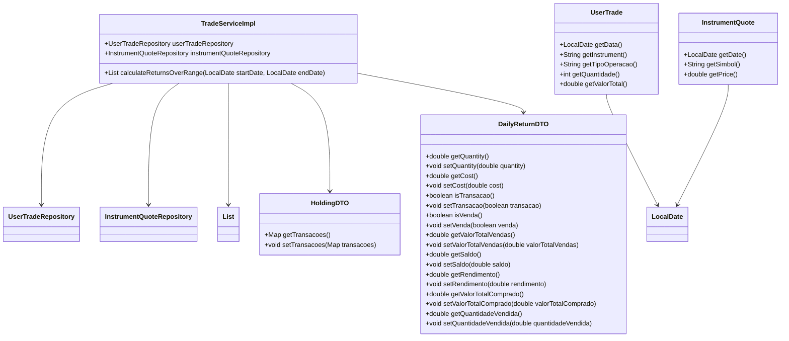

## Desafio ZG

**Dev:** João Vitor de Lima  
**Desenvolvedor Fullstack**


## Principais Tecnologias

- **Java 17:** versão 17.0.6-tem
- **Spring Boot 3:** 3.3.4
- **Spring Data JPA:** versão mais recente
- **Spring Data Postgresql:** versão mais recente
- **OpenAPI (Swagger):** 2.6.0

🚨 **Aviso:** Certificasse que as seguinter portas estão disponíveis: 8080, 4200, 5432

## Diagrama de Classes (Domínio da API)



## API Endpoints
-------------

| Método | Endpoint                                   | Descrição                                   |
|--------|--------------------------------------------|---------------------------------------------|

| GET    | `/api/zg-invest/calcularRendimentos?dataInicial=2019-01-17&dataFinal=2020-01-22` 


## Como utilizar

```bash
   
    sudo docker-compose up --build
    sudo docker-compose exec postgres psql -U postgres -d bolsa -f /docker-entrypoint-initdb.d/bolsa.bkp
```


1. **SWAGGER DISPONÍVEL**
   - **URL:** http://localhost:8080/swagger-ui/index.html

1. **Front-end**
 - **URL:**  http://localhost:4200/


<p align="left">
  💌 Contatos: ⤵️
</p>

<p align="left">
  <a href="mailto:ozymandiasphp@gmail.com" title="Gmail">
  </a>
  <a href="https://www.linkedin.com/in/jo%C3%A3o-vitor-de-lima-74441b1b1/" title="LinkedIn">
  </a>
  <a href="https://wa.me/5581989553431" title="WhatsApp">
  </a>
</p>


